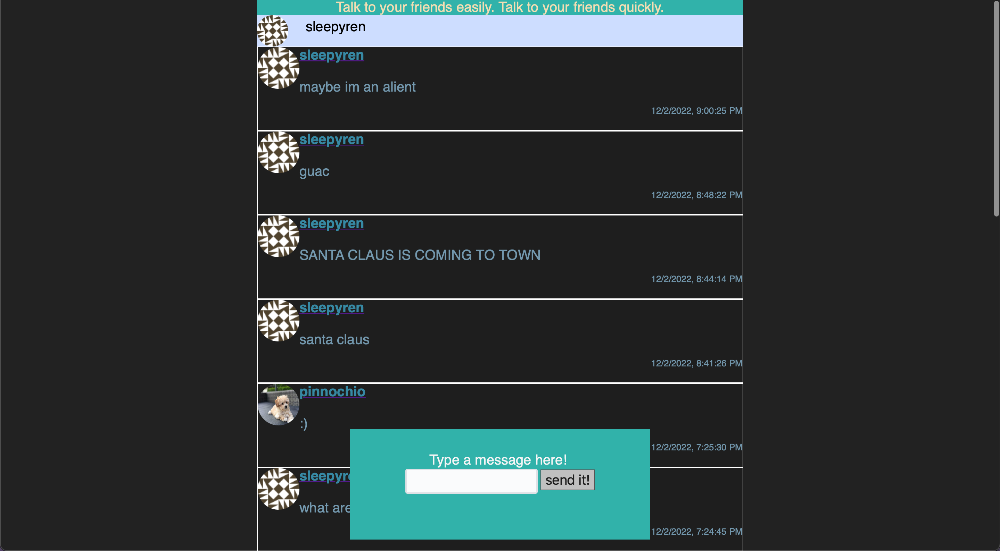
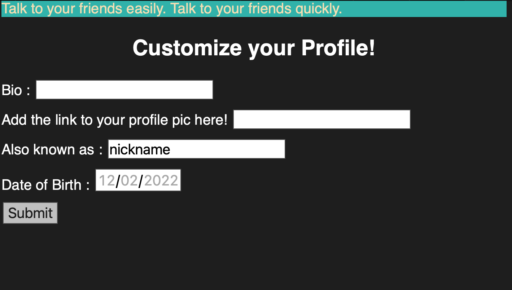
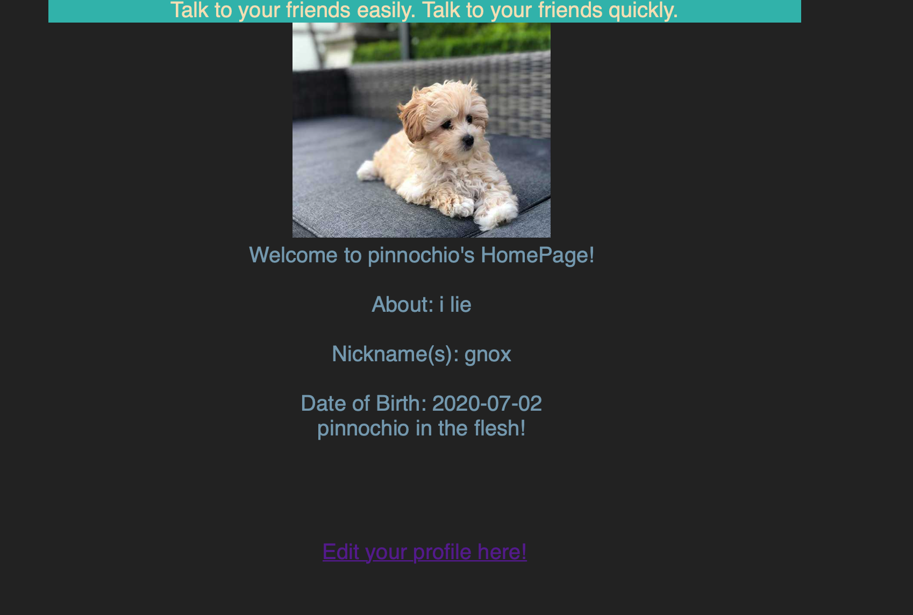
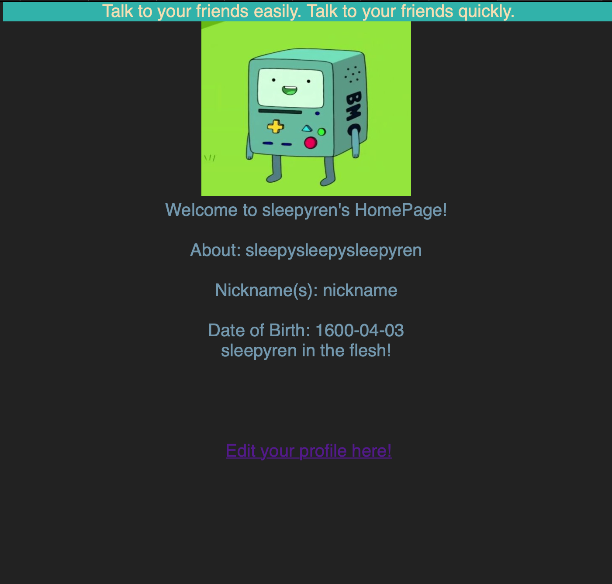

Social Messaging App

(Ren Social Media)


## Overview

I like to chat with my friends on social media. However, I am interested  in designing my own social media app to have scrutiny over the security of the messages

## Data Model


The application will store Users, Posts, and items

users can have multiple attributes
posts can many posts!
and items (like collectibles)


An Example User:

```javascript
{
  username: "renaldo ;)"
  password: // a password hash,
  email:    "renaldogetshacked@gmail.com,"
  details: {profilepic: "link to image",bio: "dont try me", DOB: "march 1", nickname: "brad"  }
}
```

An Example Message

```javascript
{
  user: // a reference to a User object
  message: "Toys",
  createdAt: // timestamp
}
```


## [Link to Commented First Draft Schema](db.mjs) 

## Wireframes


/- home page to see all the posts



/change_self - page for changing details about your own profile!



/self or /user/[INSERT USERNAME] - pages for viewing own profile





## Site map


Here's a [Sitemap](documentation/sitemap.png), but you can create one without the screenshots, drop shadows, etc. ... just names of pages and where they flow to.

## User Stories or Use Cases


1. as non-registered user, I can register a new account with the site
2. as a user, I can log in to the site
3. as a user, I can create a new post
4. as a user, I can view all of the new replies on the home page
5. as a user, I can personalize my profile page.
6. as a user, I can view any other user's profile page.

## Research Topics


* (3 points) Unit testing with Mocha
    * Will learn and use this for easier testing
* (3 points) Perform client side form validation using custom JavaScript or JavaScript library
    * sessions
* (2 points) CSS preprocesser - SASS
    * make website pretty 

8 points total out of 8 required points 


## [Link to Initial Main Project File](app.mjs) 


## Annotations / References Used


1. [mongoose](https://stackoverflow.com/questions/16998998/mongodb-how-to-define-a-schema)
